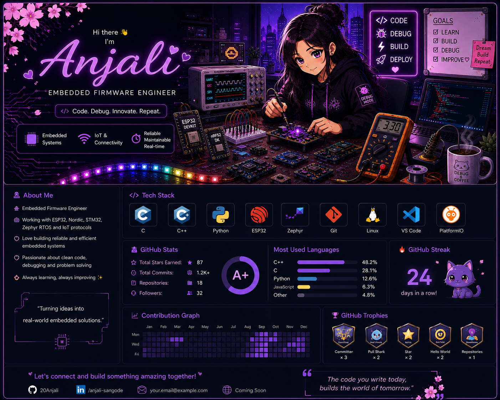
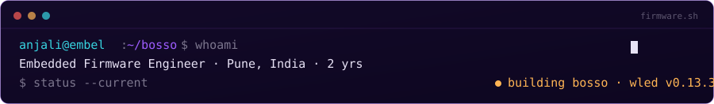
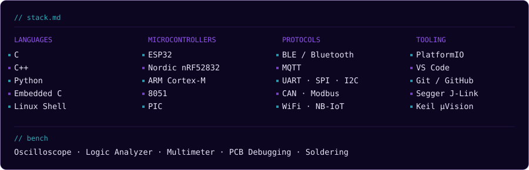
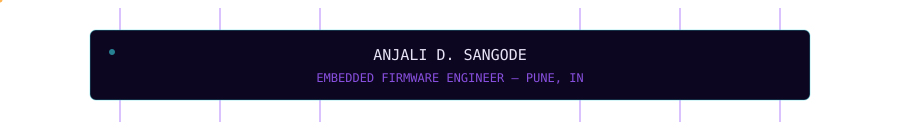

<div align="center">





<br/><br/>

<a href="https://github.com/20Anjali"></a>
<a href="https://linkedin.com/in/anjali-sangode-620766168"></a>
<a href="mailto:sangodeanjali97@gmail.com"></a>

</div>


<sub><code>// about.md</code></sub>

## About

I'm an embedded firmware engineer in Pune, currently at **Embel Technologies**, and most of my working hours split between two boards: an ESP32 running a heavily customized WLED fork, and an nRF52832 talking to a Nordic SoftDevice.

Right now that means migrating the **WLED Smart Lighting System** from WLED v0.13.3 to v0.16.0 — tracing regressions across MQTT, the audio-reactive pipeline, and OTA, one commit at a time. Before that: BLE-configured sanitization units, an NB-IoT meter reader, and an ESP32 soil sensor logging quietly to an FTP server over an unreliable network.

I like firmware because the bugs are honest — a missing `volatile`, a wrong macro, a byte dropped mid-stream. Find it, fix it, watch the board behave correctly. That loop is more or less why I got into electronics.


<sub><code>// stack.md</code></sub>

## Stack




<sub><code>// building.md</code></sub>

## Currently Building

**WLED Smart Lighting — WLED v0.13.3 → v0.16.0**
A commercial ESP32 firmware migration: moving a deeply customized codebase onto a modern WLED base without losing any of the custom behavior.

```
[AUDIO]  Traced 4 breaks between the old Atuline SR-fork and the v0.16.0
         usermod architecture — build flags, gain defaults, AGC timing.
[MQTT]   Fixed a self-subscription feedback loop and a /seg/N handler
         bug (deserializeState() vs deserializeSegment()).
[JSON]   Chased down a self-referencing DynamicJsonDocument stack overflow.
[MUSIC]  Mic-toggle logic that snapshots/restores LED state and force-
         switches into an audio-reactive effect.
[CONFIG] Ported the VERSION/vid system so legacy configs migrate safely
         instead of silently breaking.
```


<sub><code>// projects.md</code></sub>

## Projects

**Smart Lighting Firmware — WLED** · `ESP32` `MQTT` `OTA` `Audio-Reactive`
Migrated a heavily customized WLED-based smart lighting product to a modern firmware base, resolving MQTT control regressions, audio-reactive issues, and OTA flow changes.

**Irradiation Soil Sensor** · `ESP32` `CSV` `FTP`
Acquires soil sensor data, generates CSV logs, compresses them into ZIP files, and uploads to an FTP server with reliable backup handling for network failures.

**UV Rakshak Sanitization** · `ESP32` `BLE` `PIR`
BLE-enabled firmware for wireless parameter configuration, integrating PIR and microwave sensors to run safe, automated sanitization cycles.

**IoT Automatic Meter Reading** · `nRF52832` `NB-IoT` `BLE`
Firmware for an automatic meter-reading device — BLE configuration interface, plus a JSON payload design for reliable cloud data transmission.


<sub><code>// stats.md</code></sub>

## Stats

<div align="center">


</div>


<sub><code>// timeline.md</code></sub>

## Timeline

```
2020   BE, Electronics Engineering — K.D.K. College of Engineering, Nagpur
2023   PG Diploma, HPC Application Programming — CDAC ACTS, Pune
2024   Diploma, Embedded Systems — Envision Computer Training Institute, Pune
2025   Embedded Firmware Developer — Embel Technologies, Pune
 now   Leading the WLED v0.13.3 → v0.16.0 firmware migration
```

**Next:** FreeRTOS internals · embedded Linux · Zephyr / Matter for connected lighting



